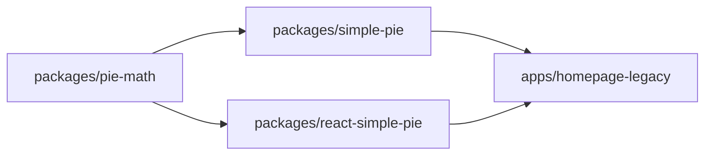

<div align="center">
  <h1>Simple Pie Monorepo<br/>🔧 🥧 🍩</h1>
  <p>Super light weight and super simple <strong>SVG</strong> pie/doughnut diagram packages</p>
</div>

<hr/>

| project                                                   | badges                                                                                                                                     |
|-----------------------------------------------------------|--------------------------------------------------------------------------------------------------------------------------------------------|
| [homepage](https://simple-pie.netlify.app/)               | [](https://github.com/serjilyashenko/simple-pie-project/actions/workflows/homepage-legacy-deploy.yml) |
| [simple-pie](./packages/simple-pie/README.md)             |   <br/>   |
| [react-simple-pie](./packages/react-simple-pie/README.md) |   <br/>   |

## Overview

This project creates simple svg pie and doughnut charts for infographics like graphs ant others.

Check out the demo [here](https://simple-pie.netlify.app/)

## Motivation

Some time ago I had to integrate a network graph. And the every node of the network graph would be tiny pie chart.
The network graph library doesn't support anything else except png or svg as node inner content.
So, it is not very nice idea to keep a bunch of png or svg files for every case of data distribution.
And for obvious reasons it is not possible to use HighCharts, Chart.js or other data visualization library.
(Perhaps it would work with d3, but I'm not sure, it is an overkill to keep such big library for the such small purpose)

Well the `simple-pie` does exactly this thing. It generates the smallest possible SVG pie diagrams that can be integrated into network graphs, maps, or any other cases that can't accept heavy diagram solutions like Highcharts or even D3.


## Monorepo

Simple-pie project is utilising a monorepo for a development and deployment. Read more in [monorepo.md](./docs/monorepo.md)

```tree
simple-pie-project
├─ docs
├─ apps
│  └─ homepage-legacy
└─ packages
   ├─ pie-math
   ├─ simple-pie
   ├─ react-simple-pie
   └─ tsconfig
```

## Installing packages

1. Make sure you're in the root directory of the monorepo.
2. Run the installation command:
```bash
npm install
```

Workspaces are [symlinked](https://en.wikipedia.org/wiki/Symbolic_link) into `node_modules`.
To check symlink state run the command:
```bash
npm ls --link=true --depth=0
```

> ⚠️ After add/remove workspaces, or change their locations on the filesystem, it is necessary  to re-run the install-command
> from root to set up workspaces again

## Scripts

Remove all `node_modules`
```bash
npm run clean
```

Build all workspaces:
```bash
npm run build
```

Run all workspaces in dev mode:
```bash
npm run dev
```

Correct build order is handled by [Turborepo](https://turbo.build/repo).



Build all package workspaces (used by ci workflow read more in [package-publishing.md](./docs/package-publishing.md)):
```bash
npm run build:packages
```

Start releasing new npm package version (read more in [package-publishing.md](./docs/package-publishing.md)):
```bash
npm run changeset
```

## More readings

- [motivation](./docs/motivation.md)
- [monorepo](./docs/monorepo.md)
- [contributing](./docs/contributing.md)
- [package-publishing](./docs/package-publishing.md)
  - [module-systems](./docs/module-systems.md)
- [deploy](./docs/deploy.md)
