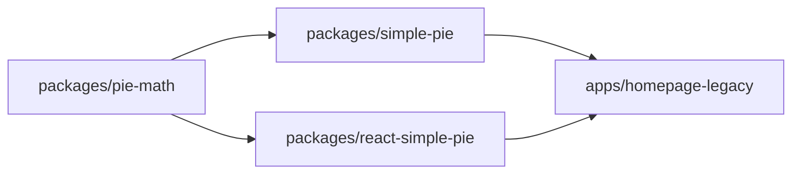

<div align="center">
  <h1>Simple Pie Monorepo<br/>🔧 🥧 🍩</h1>
  <p>Super light weight and super simple <strong>SVG</strong> pie/doughnut diagram packages</p>
</div>

<hr/>

| project                                                   | badges                                                                                                                                                                                                                                                                                            |
|-----------------------------------------------------------|---------------------------------------------------------------------------------------------------------------------------------------------------------------------------------------------------------------------------------------------------------------------------------------------------|
| [homepage](https://simple-pie.netlify.app/)               | [](https://github.com/serjilyashenko/simple-pie-project/actions/workflows/homepage-deploy.yml)                                                                                                                                                                                                                                                                                                   |
| [simple-pie](./packages/simple-pie/README.md)             |   <br/>                           |
| [react-simple-pie](./packages/react-simple-pie/README.md) |   <br/>   |
| [homepage-legacy](https://simple-pie-legacy.netlify.app/) | [](https://github.com/serjilyashenko/simple-pie-project/actions/workflows/homepage-legacy-deploy.yml)                                 |

## Overview

The `simple-pie` package family offers an easy way to create `SVG` pie and doughnut charts. These packages are lightweight
and ideal for situations where you need small, simple charts, such as in network graphs or other compact visualizations.

Check out the demo [here](https://simple-pie.netlify.app/)

## Motivation

The idea for the `simple-pie` packages came from a need to add small pie charts to a network graph. The network graph
library only supported `PNG` or `SVG` files for node content, making it impractical to store many pre-rendered images for
different data sets.

Using popular charting libraries like `Highcharts` or `Chart.js` wasn't an option because they were too complex for this
specific use case. Even though `D3.js` might have worked, it was still too large for such a simple need.

That's where `simple-pie` comes in. It provides a straightforward solution for creating the smallest possible SVG pie and
doughnut charts. These charts are perfect for embedding in network graphs, maps, or any application where you need
a simple and efficient way to visualize data without the bulk of heavier libraries.


## Monorepo

Simple-pie project is utilising a monorepo for a development and deployment. Read more in [monorepo.md](./docs/monorepo.md)

```tree
simple-pie-project
├─ docs
├─ apps
│  ├─ homepage
│  └─ homepage-legacy
└─ packages
   ├─ pie-math
   ├─ simple-pie
   ├─ react-simple-pie
   └─ tsconfig
```

## Installing packages

1. Make sure you're in the root directory of the monorepo.
2. Run the installation command:
```bash
npm install
```

Workspaces are [symlinked](https://en.wikipedia.org/wiki/Symbolic_link) into `node_modules`.
To check symlink state run the command:
```bash
npm ls --link=true --depth=0
```

> ⚠️ After add/remove workspaces, or change their locations on the filesystem, it is necessary  to re-run the install-command
> from root to set up workspaces again

## Scripts

Remove all `node_modules`
```bash
npm run clean
```

Build all workspaces:
```bash
npm run build
```

Run all workspaces in dev mode:
```bash
npm run dev
```

Correct build order is handled by [Turborepo](https://turbo.build/repo).



Build all package workspaces (used by ci workflow read more in [package-publishing.md](./docs/package-publishing.md)):
```bash
npm run build:packages
```

Start releasing new npm package version (read more in [package-publishing.md](./docs/package-publishing.md)):
```bash
npm run changeset
```

## More readings

- [motivation](./docs/motivation.md)
- [monorepo](./docs/monorepo.md)
- [contributing](./docs/contributing.md)
- [package-publishing](./docs/package-publishing.md)
  - [module-systems](./docs/module-systems.md)
- [deploy](./docs/deploy.md)
