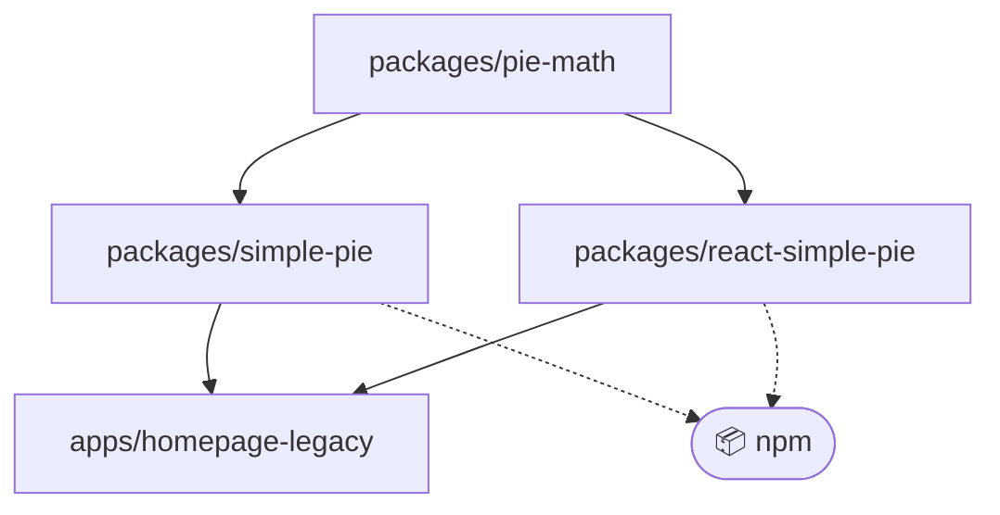

# Monorepo

The simple-pie monorepo is based on the core concepts of the Turbo [Monorepo handbook](https://turbo.build/repo/docs/handbook).

| role               | tool |
|--------------------|-----|
| package manager    | [npm](https://www.npmjs.com) |
| workspace manager  | [npm workspaces](https://docs.npmjs.com/cli/v10/using-npm/workspaces) |
| orchestration tool | [Turborepo](https://turbo.build/repo) |

## Structure

The monorepo is split into `apps` and `packages`.

- `apps` - for separate applications and E2E tests (homepage)
- `packages` - for shared packages (internal and external)

```tree
simple-pie-project
├─ config
├─ docs
├─ apps
│  └─ homepage-legacy
└─ packages
   ├─ pie-math
   ├─ simple-pie
   └─ react-simple-pie
```

`packages/pie-math` includes all calculations (business logic).\
`packages/simple-pie` and `packages/react-simple-pie` are external and are published to npm.
They don't include any calculations and they are just "transport" packages (read more in [package-publishing.md](./package-publishing.md)).


