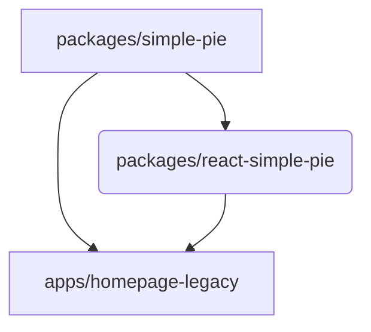

# Monorepo

Simple-pie project is utilising a monorepo for a development and deployment.

The simple-pie monorepo is based on the core concepts of the Turbo [Monorepo handbook](https://turbo.build/repo/docs/handbook).

## Structure

The monorepo is split into `apps` and `packages`.

- `apps` - for separate applications and E2E tests (homepage)
- `packages` - for shared packages (internal and external)

```
simple-pie-project
├─ docs
├─ apps
│  └─ homepage
└─ packages
   ├─ pie-math
   ├─ simple-pie
   └─ react-simple-pie
```

## Tools

| role               | tool                                                              |
|--------------------|-------------------------------------------------------------------|
| package manager    | [npm](https://www.npmjs.com) |
| workspace manager  | [npm workspaces](https://docs.npmjs.com/cli/v10/using-npm/workspaces) |
| orchestration tool | [Turborepo](https://turbo.build/repo)                             |

## Installing packages

1. Make sure you're in the root directory of your monorepo.
2. Run the installation command:
```bash
npm install
```

Workspaces are [symlinked](https://en.wikipedia.org/wiki/Symbolic_link) into `node_modules`.
To check symlink state run the command:
```bash
npm ls --link=true --depth=0
```

> ⚠️ After add/remove workspaces, or change their locations on the filesystem, it is necessary  to re-run the install-command
> from root to set up workspaces again

## Commands

Build all workspaces:
```bash
npm run build
```

Run all workspaces in dev mode:
```bash
npm run dev
```

Correct build order is handled by [Turborepo](https://turbo.build/repo).



Build all package workspaces (used by ci workflow read more in [package-publishing.md](./package-publishing.md)):
```bash
npm run build:packages
```

Start releasing new npm package version (read more in [package-publishing.md](./package-publishing.md)):
```bash
npm run changeset
```

🚧 TBD
