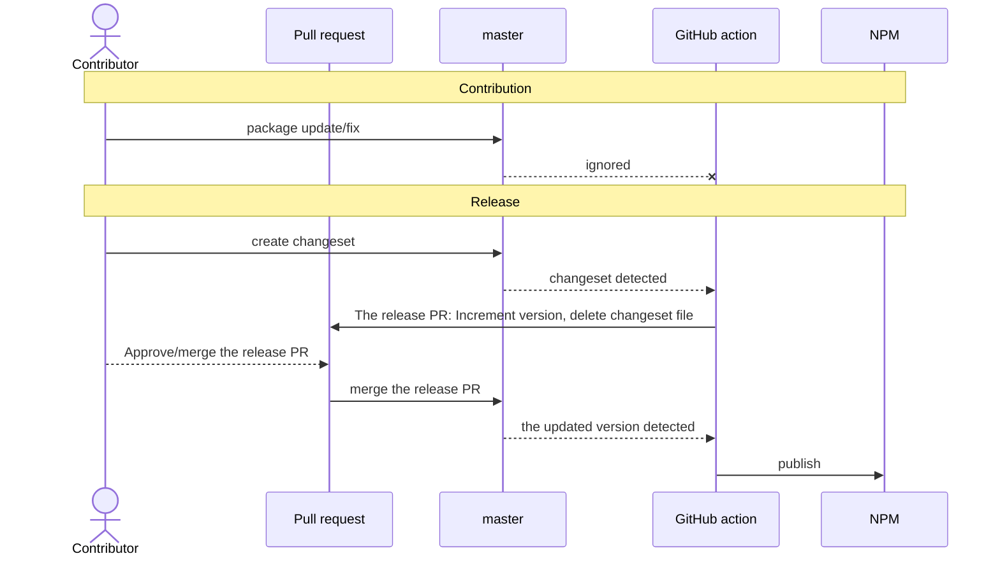

# Package publishing

The publishing is applied to external packages. The next ones:

- `packages/simple-pie`
- `packages/react-simple-pie`

## Building

[tsup](https://tsup.egoist.dev) is used for package building.\
[module-systems](./module-systems.md)

## Versioning

The version is composed of three numbers: `major.minor.patch` . The version is incremented according to the following rules:

- `Patch` : The patch number increases when the package undergoes modifications that are backward compatible.
This typically includes bug fixes or documentation updates.
- `Minor` : A minor version increment occurs when the package undergoes modifications that are backward compatible.
This may involve adding new features or modifying existing ones in a way that maintains backward compatibility.
- `Major` : The major version number increases when the package undergoes modifications that are not backward compatible.
This includes actions such as removing features or modifying existing ones in a manner that breaks backward compatibility.

## Publishing

The project packages follow an automation [changeset](https://github.com/changesets/changesets) release flow.\
It uses the [github action](https://github.com/changesets/action) to your repository in the CI pipeline.



A changeset is a file that documents the alterations made to the package. This file serves as a record of modifications,
changelogs and the version incrementation process for the package.

To start releasing new npm package version use the following command:

```bash
npm run changeset
```

This command initiates an interactive prompt, which assists in defining changes for each package within the monorepo.

Subsequently, it generates a changeset file in the `.changeset` directory. The file will include the changes was made.

When a changeset is pushed to the repository, the GitHub action will create a separate PR with changelog and incremented
version of the package.

After the PR is merged successfully, the package is automatically pushed to `npm`.
