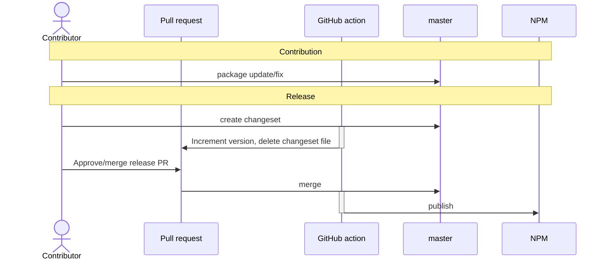

# Package publishing

## Changeset flow

The project packages follow an automation changeset release flow.\
It uses the [github action](https://github.com/changesets/action) to your repository in the CI pipeline.



To start releasing new npm package version use the following command:

```bash
npm run changeset
```

This command will open an interactive prompt that guides through the process of defining changes for each package in
the monorepo.
